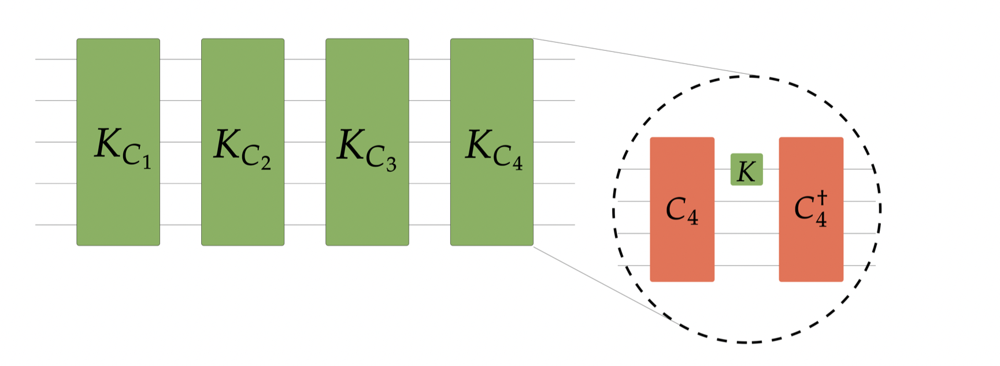

 Although we still don't know what quantum chaos is, recently there have been some steps towards the comprehension of chaos: the theory of         quantum chaos is intimately connected to quantum pseudorandomness and quantum complexity. 
 
<!--more-->
 
 ##    Chaos
 
 A unitary operator $U$ is chaotic if it is able to attain the value of $2k$ Out-Of-Time-Order correlators (OTOCs) reached by a (Haar) random unitary operator. While the Clifford group alone does not reproduce the Haar value for the general OTOCs -and thus cannot be considered chaotic - by doping Clifford circuits with a finite amount of non-Clifford gates one enforces transitions in quantum complexity by allowing such circuits in reaching the Haar value for higher order OTOCs. The goal of my research is to classify transitions in quantum complexity driven by the injection of non-Cliffordness in random quantum circuits. A unitary operator $U$ is chaotic if it is able to attain the value of $2k$ Out-Of-Time-Order correlators (OTOCs) reached by a (Haar) random unitary operator. 
  

  
  Set-up used in [Quantum chaos is quantum](https://arxiv.org/abs/2102.08406).
