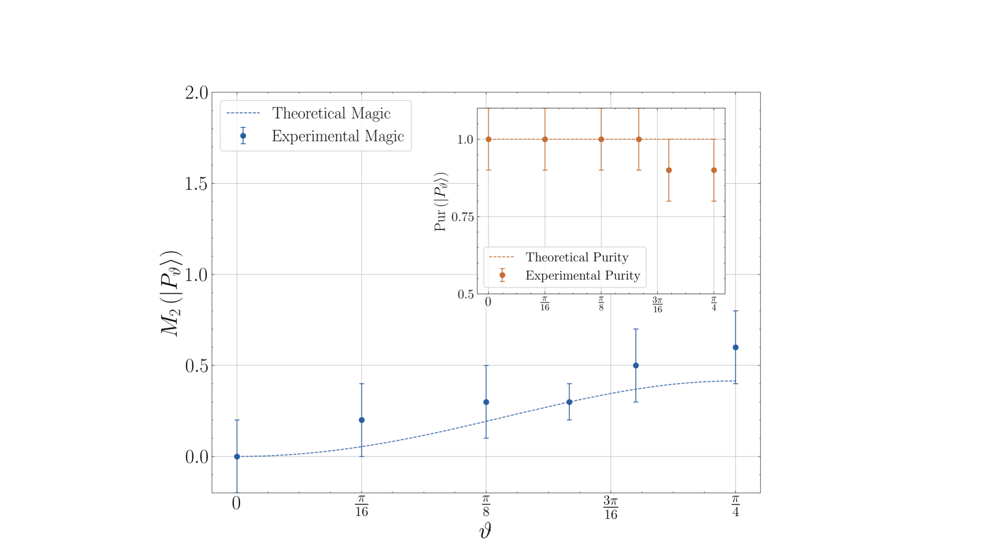

Quantum computers are more powerful than classical computers. They provide an overwhelming speed-up, the so-called quantum advantage, on certain computational tasks. Two quantum resources are responsible for the quantum advantage, magic and entanglement. It is a striking fact that these two resources can be hierarchized from the point of view of quantum complexity. Indeed, entanglement can be created through unitary operators belonging to a subgroup of the unitary group, the Clifford group. States created by the action of the Clifford group on computational basis states are called stabilizer states. This special class of states admits an efficient classical representation and, as a consequence, quantum computation employing stabilizer states only can be efficiently reproduced by classical computers. Therefore, although these states are highly entangled, they lack computational power. To unlock quantum advantage one needs states possessing magic, i.e. created employing non-Clifford gates. 

On the other hand, quantum computation employing non-entangling and magic gates can still be efficiently simulated classically with an algorithm scaling linearly in the number of qubits. Such a simple consideration tells that is rather the conjunction of these two resources, magic and entanglement, that allows computation attaining an advantage over classical computation. While the interplay between these two resources is not clear yet, in what follows, we will only focus on the framework for which the entanglement is a free resource - created by entangling Clifford gates - and the magic is the expensive one. 

States created by some non-Clifford gates are said to possess magic. Magic state resource theory has been widely employed for the problem of classical simulation of quantum dynamics. Clearly, a quantum computation that can be efficiently reproduced classically cannot afford any quantum advantage. The question is: how many non-Clifford gates are, at least, necessary to achieve quantum advantage? A hint to this answer can be found in, where Bravyi and Gosset proved that the classical simulations of Clifford circuits doped with \\(t\\) non-Clifford gates is polynomially in the number of qubits \\(n\\), and exponential in \\(t\\). Thus, states created by, at least, \\(O(n)\\) non-Clifford gates can achieve a quantum speed-up. A measure of magic, say 
\\(M(|\psi\rangle)\\), should therefore have the operational meaning of non-classical simulability: the more \\(M(|\psi\rangle)\\) increases the more expensive is the classical simulation of \\(|\psi\rangle\\).

One of the first introduced measures of magic, the [robustness of magic](https://arxiv.org/abs/1609.07488) 
\\(R(|\psi\rangle)\\), has exactly this property: let \\(N\\) be the number of non-classical resources needed for the classical simulation of 
\\(|\psi\rangle\\), then:

$$ N=O(e^{R(|\psi\rangle)}) $$

Unfortunately, the robustness of magic involves a minimization procedure over all the stabilizer decomposition of 
\\(|\psi\rangle\\), which makes the computation of 
\\(R(|\psi\rangle)}\\) impossible even for \\(n\sim 5\\). We introduced a novel measure of magic in terms of an entropic quantity, the Stabilizer Rènyi entropy 
\\(M(|\psi\rangle)\\). We show that a family of magic measures is obtained by the Rènyi entropies of the probability distribution given by the expectation value of Pauli strings. Let \\(\mathbb{P}\\) the set of all Pauli strings, then:

$$ \Xi(P):=\frac{\langle\psi|P|\psi\rangle^2}{d} $$

is a probability distribution, i.e. \\(\sum_{P\in\mathbb{P}}\Xi(P)=1\\). The stabilizer Rènyi entropy is defined as:

$$ M_{\alpha}(|\psi\rangle)= S_{\alpha}(\Xi)-\log d $$

where \\(S_{\alpha}(\Xi)\\) is the [\\(\alpha\\)-Rènyi entropy](https://en.wikipedia.org/wiki/Rényi_entropy) of the probability distribution \\(\Xi\\). The properties that make the Stabilizer Rènyi entropy an excellent candidate as a measure of magic are:

* The computation of 
\\(M_{\alpha}(|\psi\rangle)\\) involves at most \\(2^{2n}\\) expectation values.
* The \\(2\\)-Rènyi entropy can be recast in terms of a single expectation value of a hermitian operator defined on \\(4\\) copies of the Hilbert space.
* It can be experimentally measured via a randomized measurement protocol.
* It lower bounds the robustness of magic 
\\(R(|\psi\rangle)\\):

$$ M_{\alpha}(|\psi\rangle)\le 2 R(|\psi\rangle) $$

these three properties listed above allow the estimation of the classical simulation overhead, \\(N\\) defined above, possible up to \\(n\sim 20\\). With the stabilizer Rènyi entropy we can readily reproduce the result from Bravyi and Gosset: let \\(t\\) be the number of non-Clifford gates used to create the state 
\\(|\psi\rangle_t\\), then:

$$ M(|\psi\rangle_t)\approx t$$

using the lower bound to the robustness of magic, the number of classical resources needed to classically simulate 
\\(|\psi\rangle_t\\) scale exponentially in 
\\(t\\). Thus, in the [NISQ](https://arxiv.org/abs/1801.00862) era, it is of paramount importance to be able to characterize the proposed hardware on how good these machines are at performing quantum computation to attain an advantage over classical computation. In a subsequent work[^1], we indeed experimentally measure the stabilizer R\`enyi entropy on two IBM quantum falcon processors and characterize their ability to create a reliable amount of magic. Below the first direct measurement of the magic possesses by single qubit states:

However, one of the main features of the Stabilizer Rènyi entropy is that it is able to reveal the tight connection between the resource theory of magic and the concept of quantum chaos. The amount of magic that a unitary evolution can generate, its \textit{non-stabilizing power}, is intimately connected to multi-point OTOCs. In particular, the $k$-th R\`enyi entropy of the [Choi state](https://en.wikipedia.org/wiki/Choi–Jamiołkowski_isomorphism) 
\\(|U\rangle\\) associated with a unitary operator $U$ is equal to the logarithm of a $4k$-point OTOC associated with $U$:

$$ M_{\alpha}(|U\rangle)=\frac{1}{1-\alpha}\log \operatorname{OTOC}_{4\alpha}(U)$$

This simple equation allows speculations on the nature of quantum chaos and its relation with magic generation: only those unitaries with maximal non-stabilizing power can be considered chaotic. This constitutes a decisive step toward the comprehension of quantum chaos: the less simulable a quantum computation results, the more chaotic the quantum evolution, generated by that circuit, is. In particular, a given unitary operator attains the Haar value for the general $4k$ point OTOC - and thus it is considered chaotic according to the above definition - if and only if it can generate a maximal amount of magic with respect to the Stabilizer R\`enyi entropy of any order $k$. As a result, quantum chaotic evolutions are the ones able to unlock quantum advantage. 

[More on quantum chaos](https://lorenzoleone.github.io/quantumchaos/)

The stabilizer Rènyi entropy also reveals the connection between the resource theory of magic states and the problem of quantum certification of quantum states. A quantum certificate guarantees the correct application of a given quantum process or the correct preparation of the desired quantum state. This is commonly done in terms of a measure of quality, i.e. a measure of distance having the interpretation of worst-case distinguishability. However, the bottleneck of certification procedures is the feasibility in terms of resources, i.e. the number of experiments needed for the certification. In[^2] we bound the cost 
\\(N_{\psi}\\) of a direct fidelity estimation protocol, introduced by Flammia and Liu[^3], in terms of the Stabilizer Rènyi entropy:

$$ O(e^{M_{2}(|\psi\rangle)}) \le N_{\psi}\le O(e^{M_{0}(|\psi\rangle)})$$

Thus, the more magic a state contains, the harder the verification through a direct fidelity estimation protocol is. The above bounds also allow seeing the (average) scaling of the resources in terms of the non-Clifford gates 
\\(t\\) used to prepare a given state
\\(|\psi\rangle_t\\):

$$ N_{\psi}=O(\exp(t)) $$

which tells us that, on average, the certification protocol is efficient as long as the amount of non-Clifford gates used is 
\\(O(log n)\\). Remarkably, this is the same threshold for a quantum state to be efficiently simulated classically. The quantum computation able to unlock a quantum speedup is the one for which the direct fidelity estimation is not feasible: the same complexity that makes quantum technology powerful is the one that inhibits its certification.

As the above results tell, magic state resource theory is more powerful than imagined. Magic is (one of) the key resource lying behind the concept of quantum advantage. Its careful study indeed has already revealed connections with the theory of quantum chaos and the problem of direct quantum certification of quantum states. That said, more investigation is needed to build a complete picture of.. 

[^1]: [Measuring magic on a quantum processor](https://arxiv.org/abs/2204.00015)
[^2]: [Magic hinders quantum certification](https://arxiv.org/abs/2204.02995)
[^3]: [Direct Fidelity Estimation from Few Pauli Measurements](https://arxiv.org/abs/1104.4695)

