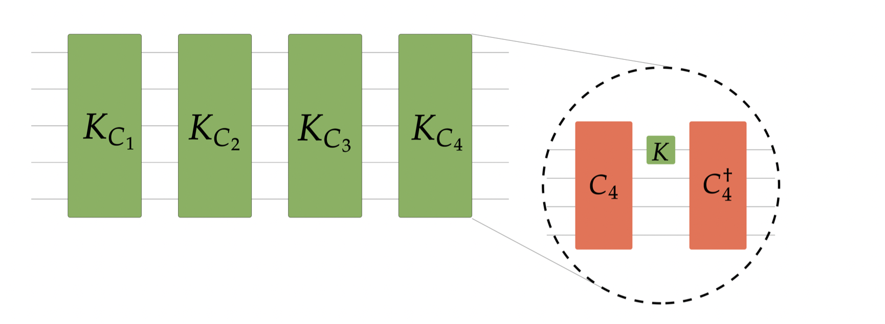

The theory of quantum chaos is elusive to characterize. In classical chaos, a chaotic dynamics suffer high sensitivity to initial condition. A phenomenon known as [butterfly effect](https://en.wikipedia.org/wiki/Butterfly_effect). In quantum unitary dynamics, different initial states cannot lead to an exponential separation of trajectories, as a trivial consequence of the conservation of the inner product between states.  A quantum version of the butterfly effect means that the chaotic unitary dynamics spread the operator throughout the systems in a way that measuring a local operator has a non-trivial effect on the measurement of a spatially separated local operator. This corresponds to the decay of the Out-of-Time-Order Correlations (OTOCs) functions, whose general expression is:

$$OTOC_{2k}(U)=\frac{1}{d}\operatorname{tr}(A_1(U)B_1A_2(U)B_2\cdots A_{k}(U)B_{k})$$

where \\(A(U)=U^{\dagger}AU\\) is the unitary evolution of a traceless Hermitian operator \\(A\\).

Waiting for a more satisfactory definition of quantum chaos, I define a unitary operator U to be chaotic if it attains a Haar value for general multi-point (2k) OTOCs, i.e. the value that would be reached by a generic unitary operator. This definition helps to relate the concept of chaos to the one of quantum pseudorandomness: a set of unitary operators, say \\(\mathcal{E}\\), is a unitary \\(k\\)-design iff it reproduces the value of \\(2k\\)-point OTOCs. While a \\(k\\)-design is automatically a \\(k^\prime\\)-design for any \\(k^\prime<k\\), being a \\(k+1\\)-design is not garanteed. This is the case for the Clifford group: it is a unitary \\(3\\)-design[^1], but fails to be a unitary \\(4\\)-design[^2]. Clifford unitary operators are able to create highly entangled states - a peculiar example is the Bell state - but, at the same time, the produced entanglement does not display complex features. For example, states entangled by measn of CLifford gates can be efficiently disentangled[^3].

[^1]: [The Clifford group forms a unitary 3-design](https://arxiv.org/abs/1510.02769)
[^2]: [Clifford group fails gracefully to be a unitary \\(4\\)-design](https://arxiv.org/abs/1609.08172)
[^3]: [Irreversibility and Entanglement Spectrum Statistics in Quantum Circuits](https://arxiv.org/abs/1407.4419)

  
  Set-up used in [Quantum chaos is quantum](https://arxiv.org/abs/2102.08406).

